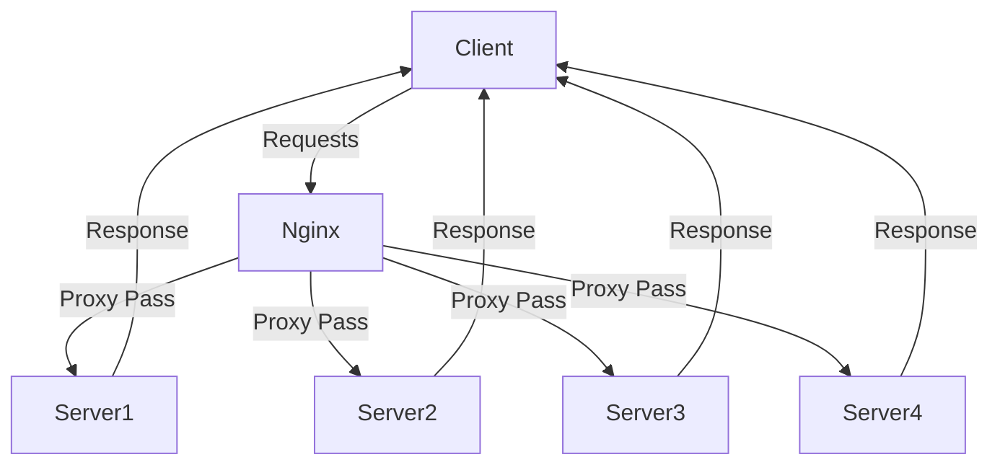

# Load Balance Project Dio.me 🌐

This project sets up a load balancing system to prevent containers residing on a single system from experiencing overhead due to high demand. By distributing the workload across multiple clusters, we ensure efficient utilization of resources and better performance.

## Project Structure 🏗️

### Database Setup 📊

The project includes a SQL file (`banco.sql`) to create a database table named `dados` with the following fields:

- `company`: Name of the company
- `cnpj`: Company registration number
- `state`: State abbreviation
- `product`: Product name
- `value`: Transaction value
- `dueDate`: Due date of the transaction
- `date`: Transaction date
- `host`: Hostname of the cluster that made the request

### PHP Script 💻

A PHP script (`index.php`) connects to the database and inserts records into the `dados` table. The `host` field is automatically filled with the hostname of the cluster making the request. The script also queries the database to retrieve and display all records.

### Nginx Configuration ⚙️

An Nginx configuration file (`nginx.conf`) sets up a proxy pass with four clusters in the `172.16.10.0/24` subnet, listening on port `4500` to match the Docker configuration. This configuration ensures that the load is balanced across the four servers.

